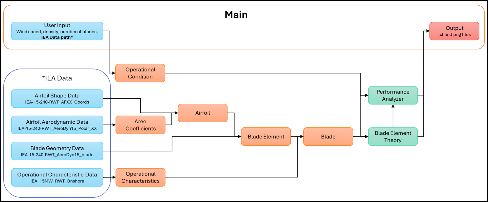

[](https://classroom.github.com/a/zjSXGKeR)


# Enhanced readability of the ReadMe with VS-Code

Press: ctrl + shift + v - Windnows
       cmd + shift + v  - Mac

# Wind Turbine BEM Modeling Package

Team: WindyWizards

## Overview

This package implements a Blade Element Momentum (BEM) model to predict the aerodynamic performance of wind turbines. It can:

- Load and process airfoil geometry and polar data
- Calculate aerodynamic coefficients at different operating conditions
- Compute induction factors through iterative BEM solution
- Generate 3D visualizations of blade geometry
- Calculate power and thrust coefficients
- Analyze turbine performance across operational conditions

The implementation is based on the IEA 15-MW reference wind turbine specifications and follows the BEM theory as described in Hansen (2015).

## Quick-start guide

1. Install the package:
```bash
pip install -e .
```
2. Install the required packages (matplotlib, numpy, scipy) in your environment:
```bash
pip install matplotlib numpy scipy
```

3. Add the IEA-15-240-RWT Data in inputs 

4. Specify in main.py the inputs (wind conditions, etc.)

5. Run the example:
```bash
python examples/main.py
```

This will:
- Load the IEA 15-MW reference turbine data
- Process airfoil data
- Calculate performance metrics
- Generate visualization plots

## Requirements 

This package requires Python 3.8 or newer and the following dependencies:

Core dependencies:
```bash
numpy>=1.20    # For numerical computations
scipy>=1.7     # For scientific computations
matplotlib>=3.4 # For plotting and visualization
```

Development dependencies:
```bash
pytest>=6.0     # For running tests
pytest-cov>=2.0 # For test coverage reporting
```

To install all dependencies, run:
```bash
# Install core dependencies
pip install numpy scipy matplotlib

# Install development dependencies (optional)
pip install pytest pytest-cov
```

Or simply install everything using pip and the pyproject.toml:
```bash
pip install -e ".[test]"
```

## Architecture

Below is the architecture diagram for the package: 


   ```
   [BEM_solver]
   ├── inputs/
   │   └── IEA-15-240-RWT/
   │       ├── Airfoils/
   │       │   ├──IEA-15-240-RWT_AeroDyn15_Polar_XX.dat
   │       │   └──IEA-15-240-RWT_AFXX_Coords.txt
   │       ├── IEA_15MW_RWT_Onshore.opt
   │       └── IEA-15-240-RWT_AeroDyn15_blade.dat
   ├── outputs/
   │   └── wind_speed_XX.Xms/
   │       ├── results.txt
   │       ├── power_curve.png
   │       ├── thrust_curve.png
   │       └── torque_curve.png
   ├── src/
   │   ├── Airfoil.py
   │   ├── BladeElement.py
   │   ├── Blade.py
   │   ├── OperationalCondition.py
   │   ├── BladeElementTheory.py
   │   └── PerformanceAnalyzer.py
   ├── tests/
   │   ├── test_airfoil.py
   │   ├── test_blade.py
   │   ├── test_blade_element.py
   │   ├── test_blade_element_theory.py
   │   ├── test_init.py
   │   ├── test_operational_characteristics.py
   │   ├── test_operational_condition.py
   │   ├── test_performance_analyzer.py
   │   └── __init__.py
   ├── examples/
   │   ├── main.py
   │   └── additional_examples/
   ├── .gitignore
   ├── LICENSE
   ├── README.md
   ├── pyproject.toml
   └── other_optional_files/
   ```
   
The Code architecture diagram is illustrating the relationships between the key components:



This diagram provides a visual representation of how the classes interact and the overall structure of the package.

The program workflow is:
1. Initialize blade with operational characteristics
2. Load blade geometry and airfoil data
3. Set operational conditions
4. Compute induction factors
5. Calculate aerodynamic performance
6. Analyze and visualize results


## Class description

The package follows an object-oriented design with the following key components:

1. **Airfoil**: Manages airfoil geometry and aerodynamic data
   - Loading coordinate data
   - Storing/interpolating lift/drag coefficients
   - File: `src/Airfoil.py`

2. **BladeElement**: Represents a blade section
   - Geometric properties (radius, twist, chord)
   - Local aerodynamic calculations
   - File: `src/BladeElement.py`

3. **Blade**: Manages blade assembly and calculations
   - Collection of blade elements
   - Loading blade geometry
   - Computing induction factors
   - File: `src/Blade.py`

4. **OperationalCondition**: Defines operating state
   - Wind speed
   - Air density
   - Angular velocity
   - File: `src/OperationalCondition.py`

5. **BladeElementTheory**: Implements BEM calculations
   - Iterative solution for induction factors
   - Force and moment computations
   - File: `src/BladeElementTheory.py`

6. **PerformanceAnalyzer**: High-level analysis tools
   - Power curve calculations
   - Performance optimization
   - Results visualization
   - File: `src/PerformanceAnalyzer.py`


